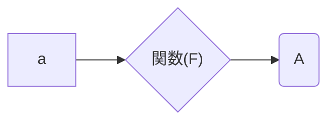

# Rと統計の勉強会 第1回

### まずはRを使ってみよう

### 1. Rの基本的な使い方

- 関数


`a`というデータの入力に対して`F`という関数で処理をすると、`A`という値が出てくる。つまり数学で言う所の$F(a)=A$と同じ。  

Rでも同じ処理が行われている。
プログラミングでは、`a`を関数`F`の<u>*引数(argument)*</u> 、`A`を<u>*戻り値*</u>という。

- 四則演算

基本的にはそのまま
```R
# 足し算
1 + 2
# 引き算
5 - 1
# 掛け算
2 * 5
# 割り算
9 / 3
```
割り切れない場合はそれぞれを別に表す
$y=ax+b$の時、`y %/% x = a, y %% x = b`
```R
# 整数商
12 %/% 5
# 剰余
12 %% 5
```
- 累乗、平方根、指数・対数  

$x^n=$`x^n`
$\sqrt{x}=$`sqrt(x) or x^0.5`
$e^i=$`exp(i)`
$\log x=$`log(x)`

ただし、$\log$の底は自然対数

$\log_{10} x=$`log10(x)`

```R
# 累乗
2^5
# 平方根
sqrt(625)
# 指数
exp(2.5)
# 対数
log(10)
```
- 階乗、組み合わせ

$x!=$`factorial(x)`
$ _n \text{C}_ r=$`choose(n,r)`
```R
# 階乗
factorial(5)
# 組み合わせ
choose(5,3)
```
- 比較演算子
論理値`TRUE`または`FALSE`で返す。

```R
# 等号
3 == 2
# 等号否定
3 != 2
# 不等号
3 > 3
3 >= 3
3 < 3
3 <= 3
```

### 2. 変数
Rでは変数を定めて、そこにデータを格納する。
```R
a <- 5  # aに5という数値を格納する
a
```
同じ変数に後から違うデータを入れると、変数内のデータは上書きされる。
```R
a <- 5
a
a <- 10 # aに10と言う数値を格納すると、5は失われて10が上書きされる
a
```
関数処理の結果を格納することもできる。
```R
sqrt(25)

a <- 25
sqrt(a)
  # 同じ結果が帰ってくる
```
関数処理の結果をさらに使う場合は変数に入れておいた方があとあと楽になる。

### 3. オブジェクト
-  データの型
   Rではそれぞれのデータに型が決められている。
      - `integer(numeric)`: 整数
      - `double(numeric)`: 実数（小数点を含む）
      - `complex`: 複素数
      - `character`: 文字列
      - `logical`: 論理値（TRUE/FALSE）
    データ型を確認するには`typeof()`か`mode()`を用いる。
```R
typeof(5)
typeof(TRUE)    

# 文字列を作るには""か''でくくる
typeof("X")
# 数字も""でくくると文字列になる
typeof("1")
```

- データの構造
  データ構造によって扱えるデータ型の種類が異なる。
  -  ベクトル（vector）: 基本の構造、1つの型しか扱えない
  - 行列（matrix）: 1つの型しか扱えない
  - データフレーム（data frame）:異なるデータの型を扱うことができる

### 4. データを作る
- ベクトルを作る
```R
v <- c(1,2,3)
v
```
 ベクトルの$n$番目の要素へのアクセスは、`[n]`を用いる
```R
v[1] # 1番目の要素を返す
```
ベクトルの要素を変数と見なして数値を入れると、数値が置き換わる
```R
v[1] <- 5 # 1番目の要素を5に置き換える
v
```
ベクトルに新たな要素を付け足すこともできる
```R
v[4] <- 4　# 4番目の要素として4を付け加える
v
```
元のベクトルの末尾と、付け加えた要素の間が空いていると、NAとなる
```R
v[6] <- 6　# 5番目の要素がないので、5番目はNAとなる
v
```
- 行列を作る 
  
$n \times m$行列を作る際は、`nrow`/`ncol`で行数・列数を指定する。 
要素の並びは、デフォルトは列毎になっているが、byrow=TRUEとすると行毎に並べることができる。
```R
m <- matrix(c(1,2,3,4),nrow=2)
m
m <- matrix(c(1,2,3,4),nrow=2,byrow=TRUE)
m
```
行、列、要素へのアクセスはベクトルと同じ  
要素の変更はベクトルと同じなので省略
```R
# 1行目へのアクセス
m[1,]
# 2列目へのアクセス
m[,2]
# 2行2列目へのアクセス
m[2,2]
```
行、列を付け加えるには、`rbind()`または`cbind()`を使う
```R
# 行を付け加える
m1 <- rbind(m,c(5,6))
m1
# 列を付け加える
m2 <- cbind(m,c(5,6))
m2
```
- データフレームを作る
```R
id <- c("A","B","C","D")
x <- c(1:4)
y <- c(11:14)
df <- data.frame(ID=id,x=x,y=y)
df
```
データフレームへのアクセスは`$`を用いることで、系列名ごとにアクセスできる
```R
df$x
```
行列と同じで、`[]`を用いれば行、列ごとにアクセスできる
```R
df[1,]
```
データフレームに列を付け加える場合は、`transform()`を使う
```R
z <- c(21:24)
df <- transform(df,z=z)
df
```
---
（ここで知っておいた方がいい関数）
- 数値を作る   
1. ランダムサンプリング

`sample(x,y)`関数は、`x`にランダムサンプリングしたいデータのベクトル、`y`にサンプリングしたい個数を入れると、xの範囲でy個の数値をベクトルとして返す。
```R
sample(1:10,5)
```
`sample()`関数でのサンプリングは、デフォルトでは重複サンプリングなしになっている。重複サンプリングしたい場合は`replace=TRUE`を指定すれば良い。（特に、yの個数がxの長さを超えてしまう場合は重複サンプルありにしないとエラーが出る）
```R
sample(1:10,20,replace=TRUE)
```
`x`には文字列を入れることも可能
```R
cha <- c("A","B","C","D","E")
sample(cha,2)
```

2. 等差数列

`seq(x,y)`関数は、最小値`x`から`y`までの間で、等差1の等差数列をベクトルとして返す
```R
seq(1,10)
```
これは`:`を用いて代用可能
```R
1:10
```
等差を決めたい場合は`by=n`でnを指定してやれば良い
```R
seq(1,10,by=0.5)
```
等差を決めず、数列の個数だけを決める場合は`length=n`でnを指定してやれば良い
```R
seq(1,10,length=19)
```

3. データの繰り返し

`rep(x,y)`および`replicate(y,x)`関数は、データ`x`を`y`回繰り返してベクトルに返す関数である
```R
rep(0,10)
replicate(10,0)
```
`sample()`関数同様、`x`に文字列を入れることも可能
```R
rep("M",5)
replicate(5,"M")
```
`x`にベクトルを組み込んだ場合、`rep()`関数は`x`を`y`回だけ並べたベクトルとして返すが、`replicate()`関数は列ベクトル`x`を`y`列だけ並べた行列として返す
```R
rep(1:3,3)
replicate(3,1:3)
```
ランダムな数値を取る関数を繰り返し関数に組み込む場合、`rep()`関数は1つのランダム数値のみを繰り返すが、`replicate()`関数は回数分だけ毎回数値を返すように働く
```R
rep(sample(1:10,1),5)
replicate(5,sample(1:10,1))
```

### 5. データを読み込む
- ディスクにあるデータを読み込む

Rでは様々なファイルを読み込むことが可能。
もっとも多い（と思われる）csvファイルを読み込む場合は`read.csv()`関数を使うと簡単。
```R
read.csv(ファイル名)
```
ただし、読み込むファイルとRの作業ディレクトリが同じでないと読み込めないので注意。

データ処理をExcelでしている場合は、対象のデータシートをcsv化して読み込むといい。

- Web上のデータを読み込む

デバイスによって異なるが、単純なcsvファイルだと`read.csv()`だけで読み込める場合もある。
```R
read.csv(URL)
```
今回の勉強会でデータをアップしているGithubはもう1クッション処理が必要になる。
まずは`RCurl`というパッケージをダウンロードして適用する。
```R
install.packages("RCurl")
library(RCurl)
```
`getURL()`関数を使ってURLを取得し、そこからデータを読み込む。
```R
url <- getURL("https://...")
read.csv(text=url)
```


### 6. 関数を作る
自分で新たな関数を作ることができる。
```R
# 数値を入れると1加える関数
f <- function(x){x+1}
f(1)
```
ループ文や条件式を入れることで複雑な関数を作ることも可能（今のところはしない）だが、`function()`で関数を作っていることが理解できればok
### 7. グラフを書く
デフォルト関数でも様々なグラフを描くことができる。
それぞれのグラフ関数に描写のためのパラメーターが数多くあるが、それは今後実際に使用していく中で確認していく。
- 散布図（Scatter plot）  

点(x,y)をプロットしたグラフ
xとyの相関係数をみる時に用いる
```R
x <- sample(1:100,200,replace=TRUE)
y <- sample(1:100,200,replace=TRUE)
plot(x,y)
```


- ヒストグラム  

データ(x)を横軸に、xの頻度を縦軸に表したグラフ
xがどのような分布になるかを確かめるために必要
```R
x <- sample(1:10,100,replace=TRUE)
hist(x)
```


- 棒グラフ  

異なる標本において同一カテゴリーの結果を表す
```R
g <- c(21,35,11,49)
names(g) <- c("A","B","C","D")
barplot(g)
```


- 円グラフ

カテゴリー別の割合を示す場合などに用いる
```R
p <- c(34.3,16.2,19.8,26.1)
names(p) <- c("V","X","P","Q")
pie(p)
```


- 折れ線グラフ

データの時系列の変化などに用いる
```R
d <- c(60,72,70,98)
t <- c(1,2,5,9)
plot(t,d,type='b',pch=16)
```


- 箱ひげ図（Box plot）

中央値（第2四分位点）、第1・3四分位点などが1つのグラフで表現できる
```R
s <- sample(35:100,300,replace=TRUE)
boxplot(s)
```


- その他のグラフ
    - ビーンスウォーム
    - ヴァイオリンプロット
    - 3D散布図    など    
    これらは基本パッケージに入っていないので、パッケージインストールする必要がある。

##### 分からない関数があった時  
`help()`を使うか、`?関数名`でヘルプを参照することができる
